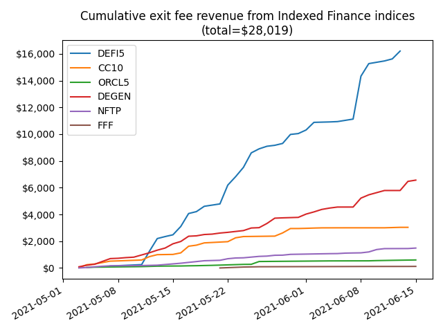

# ndx_revenue_analyzer

This repo contains `ndx_revenue_analyzer.py`, a simple python script to calculate the price to sales ratio (P/S) for [$NDX](https://www.coingecko.com/en/coins/indexed-finance), for the "live" $NDX price, by calculating exit fee revenues from [Indexed Finance](https://indexed.finance/) indices, during a specified time interval.

> :warning: You need an [etherscan API key](https://etherscan.io/apis) to run this. See comments within `ndx_revenue_analyzer.py` for more info.

For example, to calculate P/S since May 3 (when exit fees were introduced for all indices) through June 15th (inclusive):

```bash
#              dates (inclusive): START      END
$ python3 ndx_revenue_analyzer.py "2021-5-3" "2021-6-15"
NDX P/S ratio (based on 44-day avg revenue, annualized) = 90.9
```


By default, this script also saves a .png figure which breaks down revenue by index. For example, the command above generates the following plot:

